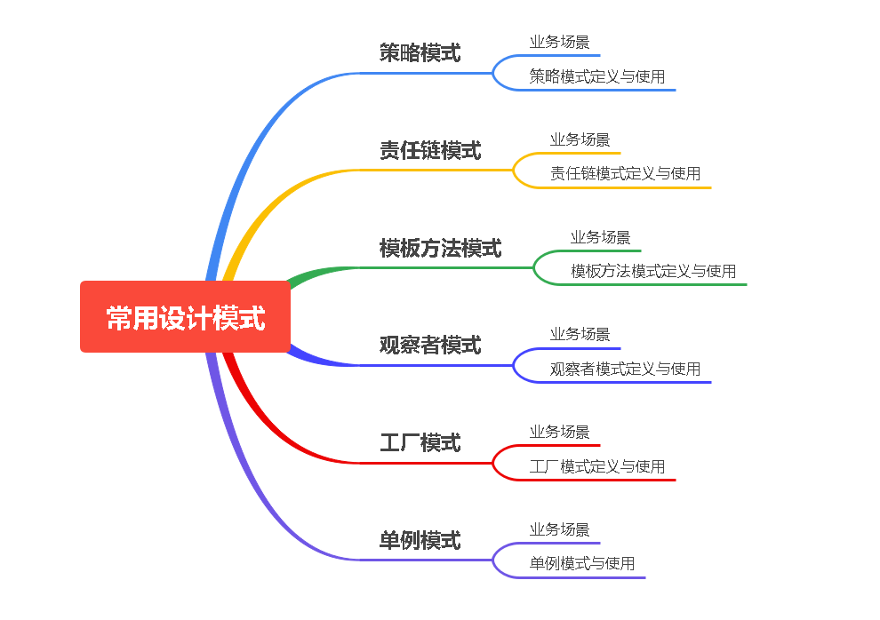

# 设计模式

## 常用设计模式中英文名称对照表

| 中文名称     |英文名称
|----------| ----------------------
| 简单工厂模式   |SimpleFactoryPattern
| 工厂方法模式   |FactoryMethodPattern
| 抽象工厂模式   |AbstractFactoryPattern
| 建造者模式    |BuilderPattern
| 原型模式     |PrototypePattern
| 单例模式     |SingletonPattern
| 适配器模式    |AdapterPattern
| 桥梁/桥接模式  |BridgePattern
| 组合模式     |CompositePattern
| 装饰模式     |DecoratorPattern
| 门面/外观模式  |FacadePattern
| 享元模式     |FlyweightPattern
| 代理模式     |ProxyPattern
| 责任链模式    |ChainResponsibilityPattern
| 命令模式     |CommandPattern
| 解释器模式    |InterpreterPattern
| 迭代器模式    |IteratorPattern
| 中介者模式    |MediatorPattern
| 备忘录模式    |MementoPattern
| 观察者模式    |ObserverPattern
| 状态模式     |StatePattern
| 策略模式     |StrategyPattern
| 模板方法模式   |TemplateMethodPattern
| 访问者模式    |VisitorPattern

## 常用设计模式

{:width="100px" height="100px"}